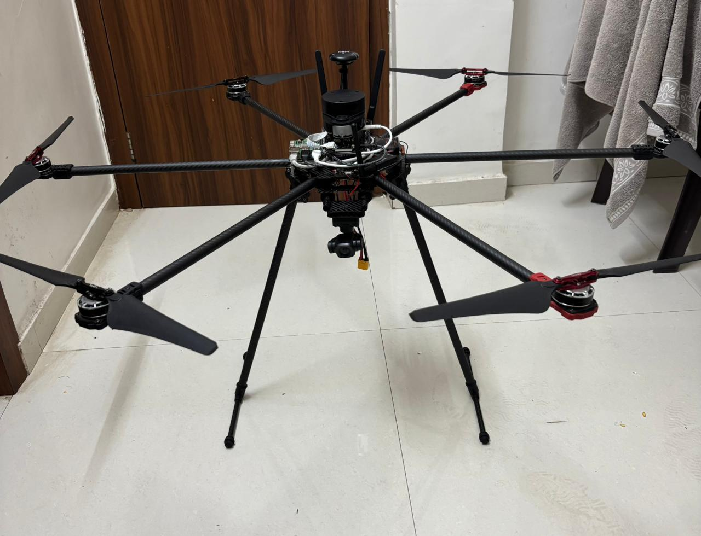
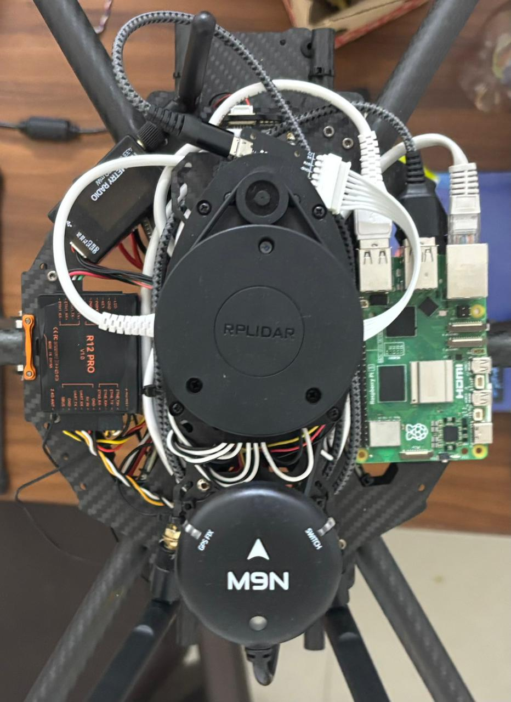
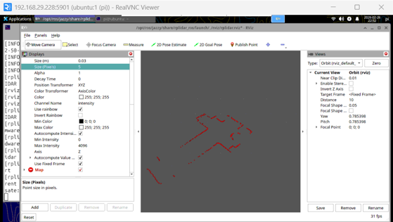
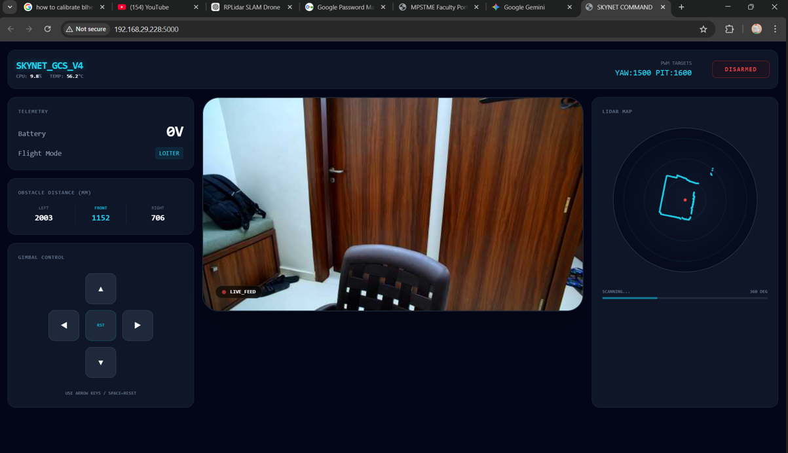

# AI Surveillance Drone System 🚁

An advanced AI-powered surveillance drone integrating real-time AI video transmission, LiDAR-based perception, and intelligent ground control for monitoring and autonomous operations.

---

## 🚁 Drone Overview

A custom-built hexacopter platform designed for real-time sensing, edge processing, and remote operation.

---

## 🔧 Hardware Stack

### Core Components:
- **Flight Controller:** Pixhawk6c
- **Onboard Computer:** Raspberry Pi 5  
- **Transmission System:** Skydroid H12 Pro  
- **Camera:** SIYI A8 Mini (RTSP stream)  
- **LiDAR:** YDLiDAR A1M8  
- **Optical Flow Sensor:** For position estimation (GPS-denied environments)
- **GPS:** M9N GPS

### Upcoming Integration:
- 🔥 Thermal Camera (for night surveillance & heat signature detection)

---

## 📡 LiDAR Visualization (RViz)

Real-time LiDAR scan data processed using ROS2 and visualized in RViz.

---

## 🖥️ Ground Control Station (GCS)

A custom web-based control system for monitoring and controlling the drone in real time.

### Features:
- 📺 Live video feed (RTSP stream from SIYI A8 Mini)  
- 📊 Telemetry (battery, flight mode, system stats)  
- 🚧 Obstacle detection (LiDAR-based distance estimation)  
- 🎮 Manual control interface (gimbal + movement)  
- 🧭 Real-time LiDAR mapping panel  

---

## 🧠 System Architecture

The system is divided into multiple layers:

1. **Drone Layer**
   - Pixhawk (flight control)
   - Sensors (LiDAR, camera, optical flow)

2. **Onboard Processing**
   - Raspberry Pi 5
   - Sensor data processing
   - MAVLink communication

3. **Communication Layer**
   - Skydroid H12 Pro (RC + telemetry)
   - RTSP video streaming

4. **Ground Station**
   - Web-based interface
   - Real-time monitoring & control

---

## 🚀 Key Features

- Real-time video streaming from onboard camera  
- LiDAR-based obstacle detection and distance estimation  
- MAVLink communication with Pixhawk  
- Web-based Ground Control Station (GCS)  
- Modular architecture for AI integration  
- Designed for GPS-denied navigation (optical flow support)  

---

## 🧠 Tech Stack

- Python  
- OpenCV  
- ROS2  
- MAVLink (pymavlink / MAVSDK)  
- Flask (Backend - GCS)  
- HTML / CSS / JavaScript (Frontend)  

---
## ⚙️ Drone Hardware Specifications

- Frame: Custom Carbon Fiber Hexacopter Frame  
- Motors: 330KV Brushless DC Motors  
- Propellers: 16 inch foldable Props  
- ESC: 30A Oneshot ESCs  
- Battery: 20,000mah LiPo Battery Pack  

## 📁 Project Structure
